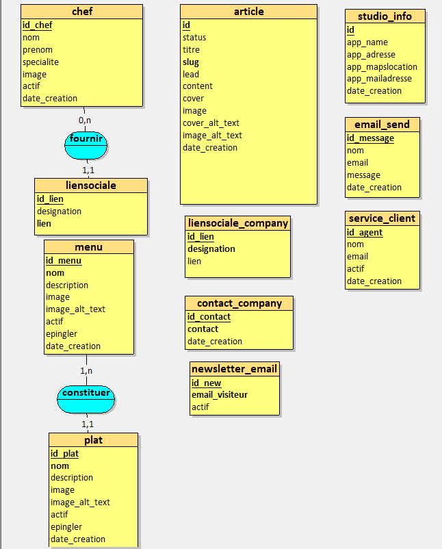
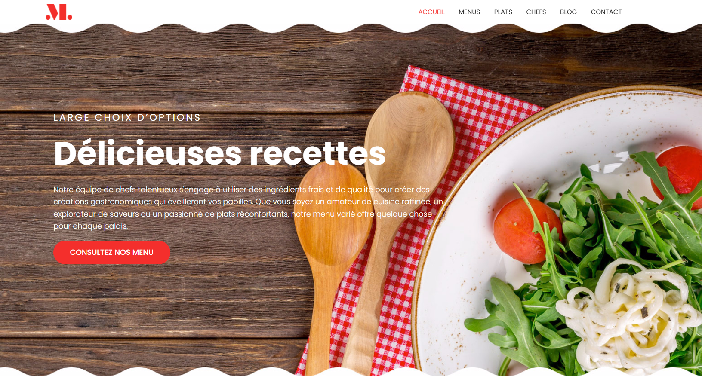
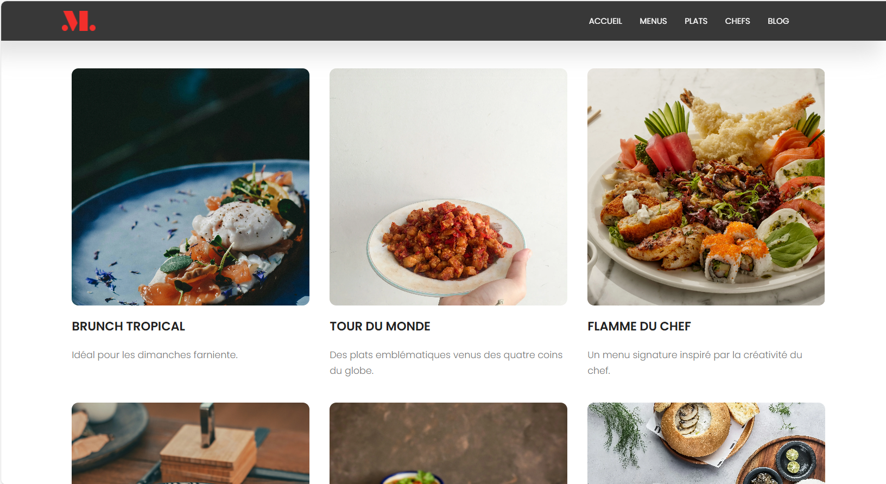
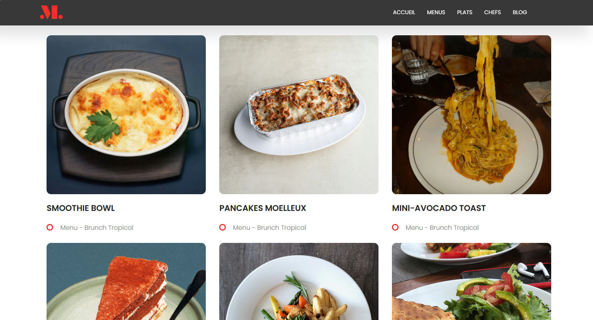
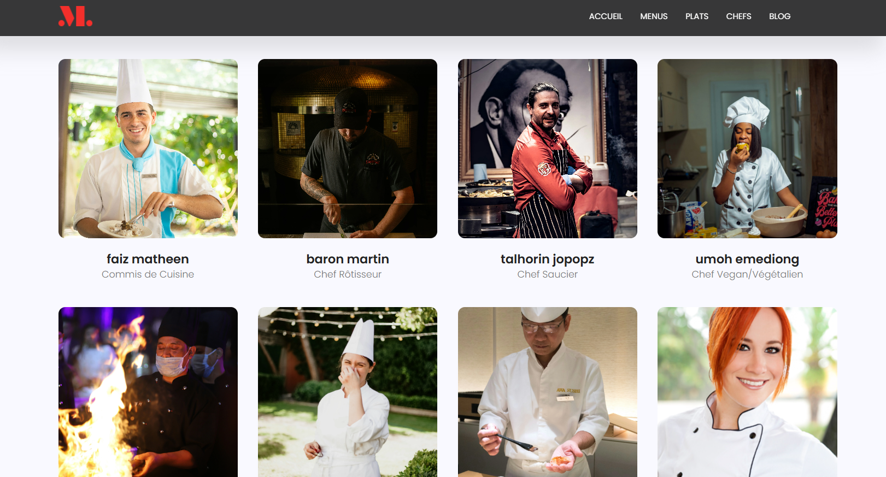
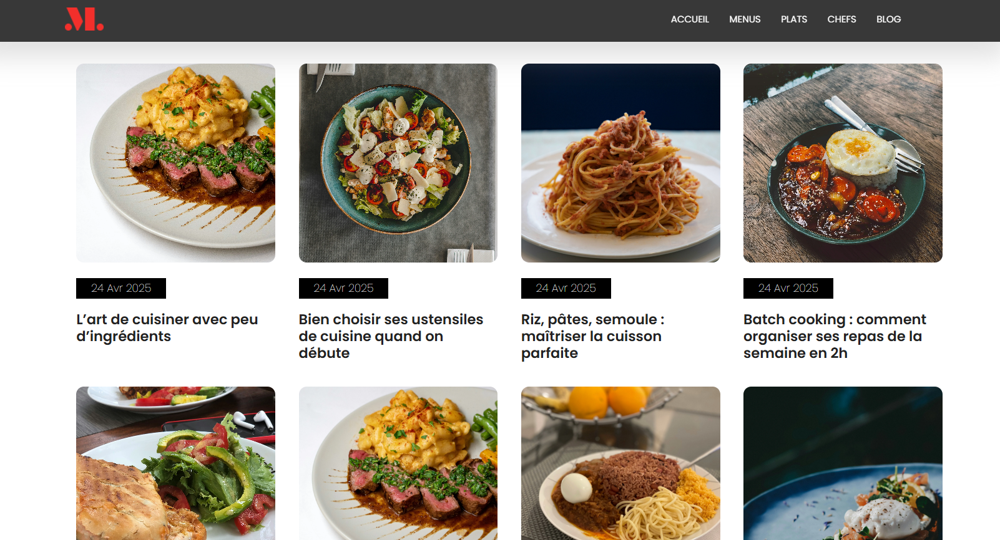

# Restaurant Monarque 🍽️

Ce projet est un petit site web de démonstration réalisé avec Django. Il représente le site du **restaurant Monarque**, conçu pour m’exercer à Django et aux bases du développement web.

## 🌟 Fonctionnalités

- [x] Affichage des **chefs du restaurant**
- [x] Présentation des **menus** et **plats offerts**
- [x] Section **blog** avec des articles culinaires publiés par le restaurant
- [x] **Formulaire de contact** pour que les visiteurs puissent écrire au restaurant
- [x] **Abonnement à la newsletter** : les abonnés reçoivent un email à chaque publication d’un nouvel article

## 🔒 Fonctionnalités non prévues dans cette version

- [ ] Pas de système d’authentification (choix volontaire pour ce projet de démonstration)
- [ ] Pas de commentaires ou de likes sur les articles

---

## 🛠️ Technologies utilisées

- Python / Django
- HTML / CSS
- Bootstrap
- SQLite (ou la base de données par défaut de Django)
- Django admin + package unfold pour la gestion interne

---

## 📝 Installation

```bash
git clone https://github.com/Franck-adjinon/Restaurant-Monarque.git
cd Restaurant-Monarque
python -m venv env
source env/bin/activate  # ou env\Scripts\activate sur Windows
pip install -r requirements.txt
python manage.py migrate
python manage.py runserver
```

---

## 🚀 Utilisation

Une fois le projet installé (voir section [Installation](#installation)), voici comment l'utiliser :

- Crée un fichier d'environnement dans la racine du projet et remplissez le avec les informations nécessaires à l’envoi de mails avec Django à savoir:

```bash
EMAIL_HOST_USER=votremail@gmail.com
EMAIL_HOST_PASSWORD=votre_mot_de_passe
EMAIL_BACKEND=django.core.mail.backends.smtp.EmailBackend
EMAIL_HOST=smtp.gmail.com
EMAIL_PORT=587
EMAIL_USE_TLS=True
```

- Voici le modèle conceptuel de données dont décris la structure de la base de données:
  

---

## 🖼️ Aperçu du site

- **Accueil**
  

- **Menus**
  

- **Plats**
  

- **Chefs**
  

- **Blog**
  

---

## 🤝 Contribuer

Les contributions sont les bienvenues ! Si vous souhaitez aider à améliorer ce projet, voici comment vous pouvez contribuer :

1. 🍴 Forkez le projet
2. 📥 Clonez votre fork localement
3. 🔧 Créez une branche avec un nom explicite (`git checkout -b correction-typo` par exemple)
4. 💡 Apportez vos modifications
5. ✅ Assurez-vous que tout fonctionne correctement
6. 📤 Poussez vos changements et ouvrez une **pull request** claire

---

## 🐛 Trouvé un bug ?

Si vous trouvez un bug ou un comportement inattendu, vous pouvez :

- 📩 Créer une _issue_ sur [GitHub](https://github.com/Franck-adjinon/Restaurant-Monarque.git/issues)
- 🔧 Soumettre une _pull request_ avec une proposition de correction
- 💬 Ou simplement me contacter via [email](mailto:franckadjinon@gmail.com)

---

## 📄 Licence

Ce projet est un logiciel open source distribué sous la licence **MIT**.  
Vous êtes libre de l'utiliser, le modifier et le distribuer, à condition de conserver les mentions de droits d’auteur et la licence d’origine.

Voir le fichier [LICENSE](./LICENSE) pour plus d'informations.

---

## 🙏 Crédits

Design réalisé par [Colorlib](https://colorlib.com/)

Merci pour votre contribution à l'amélioration du projet !
